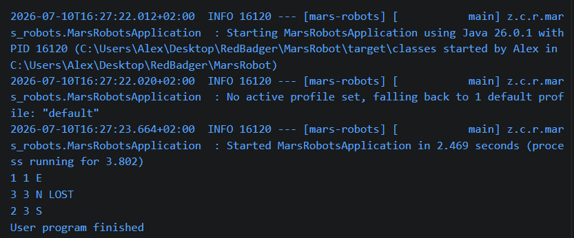

# Mars Robot Driver Application
The mars robot application is used to determine the resultant coordinates of robots on mars.

The robot instructions are processed sequentially using an input file.

The file specifies : 
- The grid size representing Mars in the first line.
- The list of robots with their initial coordinates followed by their instructions

The file location is specified using the application properties:
input.file.path=test.txt

##Techinal Specifications
- Java 26
- Spring Boot

##Test Results

Input:

5 3
1 1 E
RFRFRFRF

3 2 N
FRRFLLFFRRFLL

0 3 W
LLFFFLFLFL

Output:

##Reasoning
Initially I just put all my code in a static main method on a single class.
I broke the problem down by looking at how one robot would move first
Instructions are processed one character at a time in a for each loop.
The result of turning right or left needed to coded.
Moving forward would be dependent on which direction the robot is facing
ie if it is facing north or south it is moving on the Y axis
and if it is facing east or west it is moving on the X axis.
I just initialized and processed one robot in the main application
by hard coding its values to the first robot in the inputs given.
I checked for the min and max values of X and Y before moving the robot.
X and Y both have a min of 0 and the max is specified by the grid.
Initially I passed all the values to a single method.
If a robot's resultant x or y is greater than the max and less than the min then the robot is lost.
If the robot is lost exit out of the loop that processes the instructions.
I added console logging for each movement made by the robot using the current x, y and direction.
After this I ran my application to see if the robot's output matched the expected results.
Once the first robot was working I added additional calls to the method that can process a robot using the next inputs.
Now I added the smells variable as a multi dimentional array on the class to track the coordinates of where robots have been lost.
If a robot is lost add its coordinates to the smells array x at position 0 and y at position 1.
Now I added an additional check after a robot has been identified as lost.
If it is lost check the smells array for a matching coordinate.
If the resultant coordinate is in the smells array then dont apply the move.
Now I ran the method again to see if the results matched the expected output.
Once I had a working solution I broke the code into reusable elements
Instead of using a switch case to map the direction to degrees in the main method I extracted it to an enum.
The robot class was created to track the current coordinates and direction of a robot as well as to process instructions on a robot and get the resultant coordinates and direction as a string.
The Ground Control class was created to keep a single source of the max x and y value as well as to manage the smells array.
I created a single GroundControl instance with multiple Robot instances that reference the same GroundControl instance.
After creating a Robot instance the instruction was immediately processed using the instruction string as input to the method on Robot.
I ran the main method again now using the classes to verify the results.
After the results matched I moved on to the file processing.
I added the file reading logic and decoded the input using splitting since the x, y and direction values are comma dilemited. 
Added logic to process the first line and create the GroundControl instance.
Then process 2 lines at a time in a while loop, the first line being the Robot for which an instance is created, the second being the instructions which are used for the process method on the robot.
The resultant string is printed to the console in each loop.
If a line is blank skip it.
If the next line is null the end of the file has been reached.
In that case exit the loop.
Now I ran the application again.
Once the test results were matching I moved on to some error handling
If the file is empty ie the first line is null then throw and exception
Now I added some unit tests for my application.
Added test for a single robot as well as multiple robots processed sequentially.
After all test cases passed.
Now I extracted the filePath to application properties.
Ran the application and tests one final time to confirm all is working.